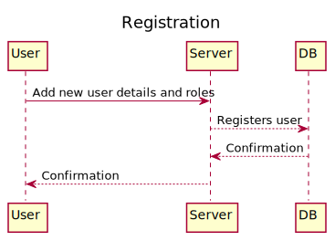
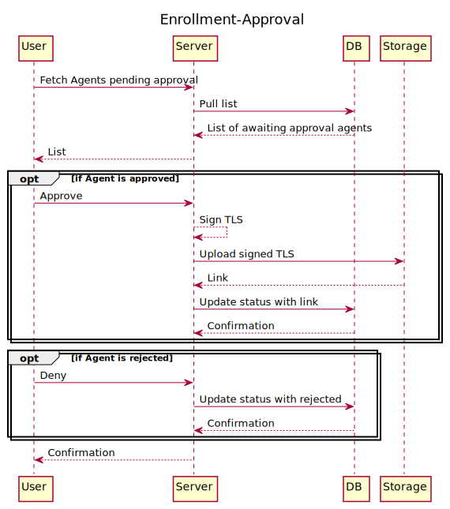
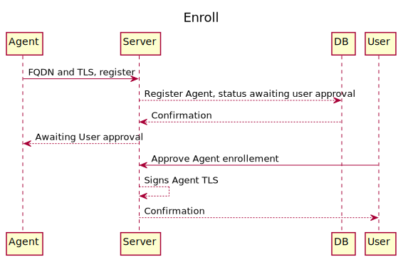
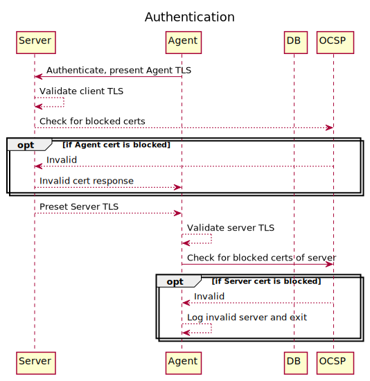
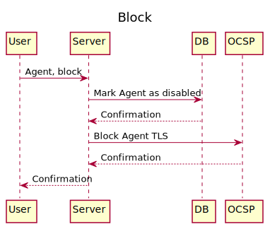

# Features

- User Management
- Agent Management
- Configurations
- Tasks
- Orchestration

# User Management

User Management has 3 major features

- Registration
- Agent Enrollment Approval

## Registration

Registration of new user can be done by an User having Add new User role.

## Agent Enrollment Approval

User having Agent management role can Approve or Deny enrollment of agents or event block already enrolled agents.

# Agent Management

Agent Management has 3 major features

- Enroll
- Authentication
- Block

## Enroll

All agents can enroll automatically, provided right Server URI is provided. However, approval of the enrollment is required from end user for successfull enrollment with the Server

## Authentication

Agent and Server uses mTLS for authentication, where Agent certs are short-lived 30 days, and issued by the Server. All certs are generated by the Server's private CA.

## Block

Blocked agents are flagged in database and also certificate thumbprint information is published on the OCSP server.

